# 存档系统类图

```mermaid
classDiagram
    %% ==================== 核心接口 ====================
    class ISaveManager {
        <<interface>>
        +LoadData(GameData _data)
        +SaveData(ref GameData _data)
    }

    %% ==================== 主线核心 ====================
    class SaveManager {
        <<singleton MonoBehaviour>>
        +SaveManager instance$
        -string fileName
        -bool encryptData
        -GameData gameData
        -List~ISaveManager~ saveManagers
        -FileDataHandler dataHandler
        +NewGame()
        +LoadGame()
        +SaveGame()
        +HasSavedData() bool
        +DeleteSavedData()
        -FindAllSaveManagers() List~ISaveManager~
        -OnApplicationQuit()
    }

    class FileDataHandler {
        -string dataDirPath
        -string dataFileName
        -bool encryptData
        -string codeWord
        +Save(GameData _data)
        +Load() GameData
        +Delete()
    }

    class GameData {
        <<Serializable>>
        +int currency
        +SerializableDictionary~string,bool~ skillTree
        +SerializableDictionary~string,int~ inventory
        +List~string~ equipmentId
        +SerializableDictionary~string,bool~ checkpoints
        +string closestCheckpointId
        +float lostCurrencyX
        +float lostCurrencyY
        +int lostCurrencyAmount
        +SerializableDictionary~string,float~ volumeSettings
    }

    class SerializableDictionary~TKey,TValue~ {
        <<Serializable>>
        +List~TKey~ keys
        +List~TValue~ values
    }

    %% ==================== ISaveManager 实现 ====================
    class GameManager {
        <<MonoBehaviour + ISaveManager>>
        +GameManager instance$
        +int lostCurrencyAmount
        +LoadData(GameData)
        +SaveData(ref GameData)
        -LoadCheckpoints(GameData)
        -LoadClosestCheckpoint(GameData)
        -LoadLostCurrency(GameData)
        -FindClosestCheckpoint() Checkpoint
        +RestartScene()
        +PauseGame(bool)
    }

    class PlayerManager {
        <<MonoBehaviour + ISaveManager>>
        +PlayerManager instance$
        +int currency
        +LoadData(GameData)
        +SaveData(ref GameData)
    }

    class Inventory {
        <<MonoBehaviour + ISaveManager>>
        +Inventory instance$
        +LoadData(GameData)
        +SaveData(ref GameData)
    }

    class UI {
        <<MonoBehaviour + ISaveManager>>
        -UI_VolumeSlider[] volumeSettings
        +LoadData(GameData)
        +SaveData(ref GameData)
        +RestartGameButton()
        +SaveAndExitGame()
    }

    class UI_SkillTreeSlot {
        <<MonoBehaviour + ISaveManager>>
        +LoadData(GameData)
        +SaveData(ref GameData)
    }

    class SwordSkill {
        <<MonoBehaviour + ISaveManager>>
        +LoadData(GameData)
        +SaveData(ref GameData)
    }

    class ParrySkill {
        <<MonoBehaviour + ISaveManager>>
        +LoadData(GameData)
        +SaveData(ref GameData)
    }

    class DodgeSkill {
        <<MonoBehaviour + ISaveManager>>
        +LoadData(GameData)
        +SaveData(ref GameData)
    }

    class DashSkill {
        <<MonoBehaviour + ISaveManager>>
        +LoadData(GameData)
        +SaveData(ref GameData)
    }

    class CrystalSkill {
        <<MonoBehaviour + ISaveManager>>
        +LoadData(GameData)
        +SaveData(ref GameData)
    }

    class BlackholeSkill {
        <<MonoBehaviour + ISaveManager>>
        +LoadData(GameData)
        +SaveData(ref GameData)
    }

    class CloneSkill {
        <<MonoBehaviour + ISaveManager>>
        +LoadData(GameData)
        +SaveData(ref GameData)
    }

    %% ==================== 调用者 ====================
    class UI_MainMenu {
        <<MonoBehaviour>>
        +ExitGame()
        +NewGame()
        +ContinueGame()
    }

    class PlayerStats {
        <<MonoBehaviour>>
        +Die()
    }

    class PlayerItemDrop {
        <<MonoBehaviour>>
        +GenerateDrop()
    }

    %% ==================== 关系 ====================
    SaveManager ..|> ISaveManager : depends on
    SaveManager --> GameData : owns
    SaveManager --> FileDataHandler : uses
    FileDataHandler ..> GameData : reads/writes
    GameData --> SerializableDictionary : uses

    GameManager ..|> ISaveManager
    PlayerManager ..|> ISaveManager
    Inventory ..|> ISaveManager
    UI ..|> ISaveManager
    UI_SkillTreeSlot ..|> ISaveManager
    SwordSkill ..|> ISaveManager
    ParrySkill ..|> ISaveManager
    DodgeSkill ..|> ISaveManager
    DashSkill ..|> ISaveManager
    CrystalSkill ..|> ISaveManager
    BlackholeSkill ..|> ISaveManager
    CloneSkill ..|> ISaveManager

    UI_MainMenu --> SaveManager : SaveGame() / HasSavedData()
    PlayerStats --> SaveManager : SaveGame() on death
    PlayerItemDrop --> SaveManager : SaveGame() on drop
    UI --> SaveManager : SaveGame()
    GameManager --> SaveManager : SaveGame() on restart
```



## 存档触发时机

| 触发点 | 调用者 | 场景 |
|--------|--------|------|
| 退出游戏 | `UI_MainMenu.ExitGame()` | MainMenu |
| 退出游戏 | `UI.SaveAndExitGame()` | MainScene 选项面板 |
| 重新开始 | `GameManager.RestartScene()` | MainScene |
| 重新开始 | `UI.RestartGameButton()` | MainScene 结束面板 |
| 角色死亡 | `PlayerStats.Die()` | MainScene |
| 物品掉落 | `PlayerItemDrop.GenerateDrop()` | MainScene |
| 程序关闭 | `SaveManager.OnApplicationQuit()` | 全局 |

## 数据流

```
SaveGame():                                          LoadGame():
                                                   
  SaveManager.SaveGame()                              SaveManager.Start()
    ├─ FindAllSaveManagers()                           ├─ dataHandler.Load() → GameData
    ├─ foreach ISaveManager:                           ├─ foreach ISaveManager:
    │    saveManager.SaveData(ref gameData)             │    saveManager.LoadData(gameData)
    │    ├─ GameManager → checkpoints, currency...     │    ├─ GameManager → 恢复检查点/货币位置
    │    ├─ PlayerManager → currency                   │    ├─ PlayerManager → 恢复货币
    │    ├─ Inventory → items, equipment               │    ├─ Inventory → 恢复背包/装备
    │    ├─ UI → volumeSettings                        │    ├─ UI → 恢复音量
    │    └─ Skill scripts → skillTree                  │    └─ Skill scripts → 恢复技能解锁
    └─ dataHandler.Save(gameData)                     
       └─ JsonUtility.ToJson → file                   
```
